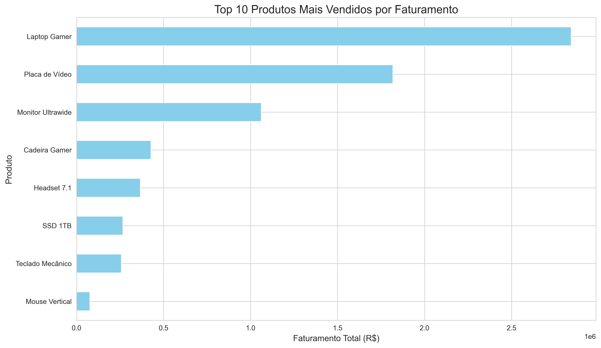
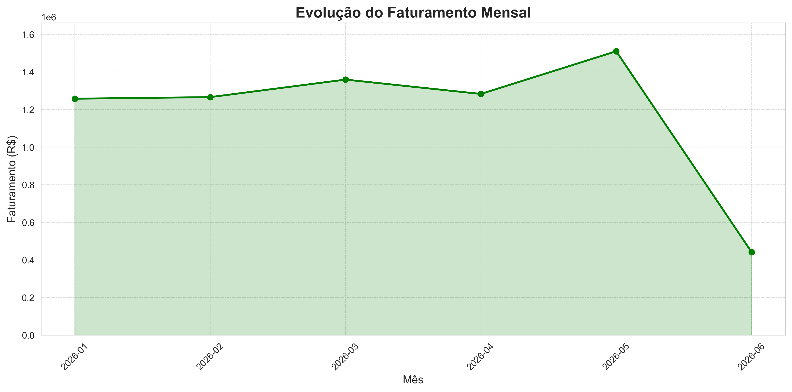
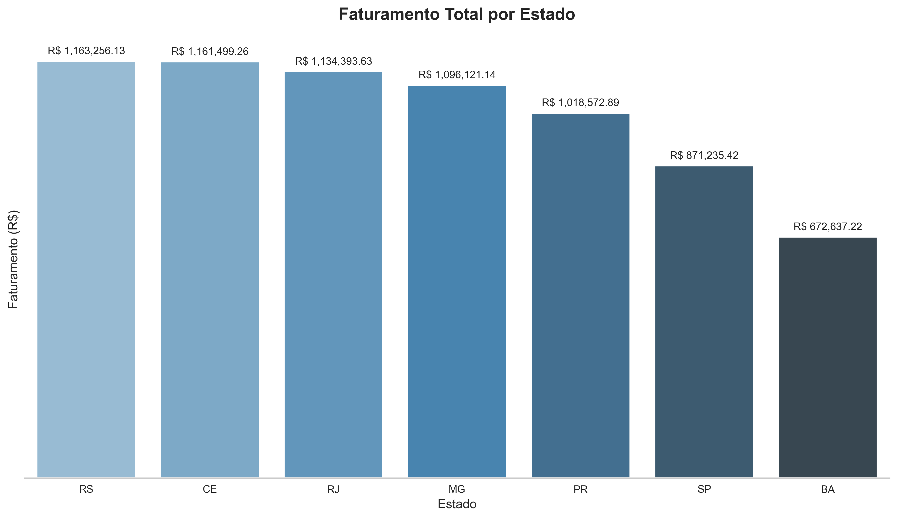
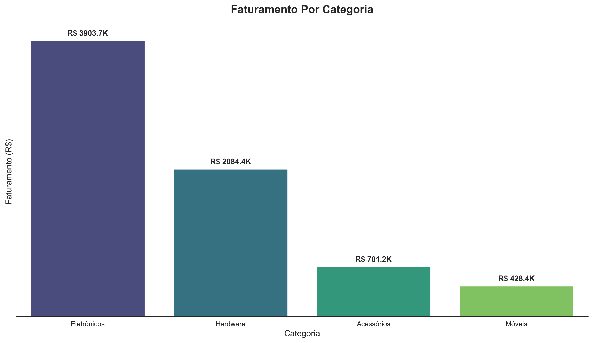

# 📊 Análise Exploratória de Dados de Vendas

Este projeto consiste em uma análise exploratória de dados (EDA) completa, utilizando **Python** para gerar insights a partir de um conjunto de dados de vendas fictício. O script abrange desde a importação e limpeza dos dados até a criação de visualizações estratégicas para suporte à tomada de decisão.

## 🎯 Objetivos do Projeto

O objetivo principal foi responder a quatro perguntas de negócio fundamentais:

1.  **Quais são os produtos mais vendidos?** (Ranking por Faturamento)
2.  **Qual a evolução do faturamento ao longo do tempo?** (Análise Mensal)
3.  **Como as vendas estão distribuídas geograficamente?** (Análise por Estado)
4.  **Qual o desempenho por categoria de produto?** (Faturamento por Categoria)

## 🛠️ Tecnologias Utilizadas

* **Python 3.13**
* **Pandas:** Manipulação e limpeza de dados.
* **Matplotlib & Seaborn:** Criação de gráficos estáticos e visualizações de dados profissionais.
* **NumPy:** Cálculos numéricos.
* **Datetime:** Manipulação de séries temporais.

## 📂 Estrutura do Código

O código segue um fluxo lógico de análise de dados:

1.  **Carga de Dados:** Importação de arquivo CSV (`vendas_finais.csv`).
2.  **Pré-processamento:** Conversão de datas e criação da coluna calculada de *Faturamento* (`Preço * Quantidade`).
3.  **Análise Descritiva:** Uso de estatística descritiva básica.
4.  **Visualização:** Geração de 4 gráficos distintos para responder aos objetivos de negócio.

## 📊 Galeria de Gráficos

As imagens abaixo foram geradas automaticamente pelo script de análise:

### 1. Top 10 Produtos


### 2. Evolução Mensal das Vendas


### 3. Faturamento por Estado


### 4. Faturamento por Categoria


## 🚀 Como Executar

1.  Certifique-se de ter o Python instalado.
2.  Instale as bibliotecas necessárias:
    ```bash
    pip install pandas matplotlib seaborn numpy
    ```
3.  Execute o script principal:
    ```bash
    python analise_vendas.py
    ```

---

## 📝 HEINRICH HOFFMAN

Desenvolvido como parte do Mini Projeto 1 da DSA (Data Science Academy).
